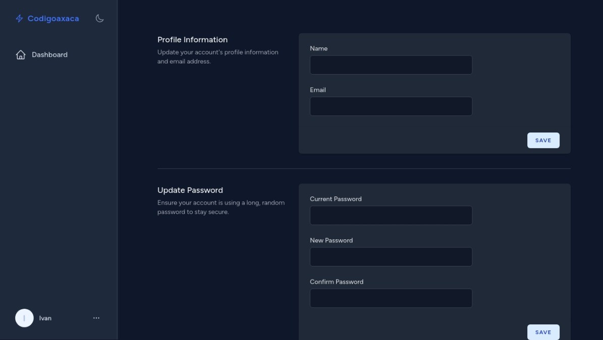

# JetAdmin

[](https://packagist.org/packages/ivanaquino/jet-admin)
[](https://github.com/ivanaquino/jet-admin/actions?query=workflow%3Arun-tests+branch%3Amain)
[](https://github.com/ivanaquino/jet-admin/actions?query=workflow%3A"Fix+PHP+code+style+issues"+branch%3Amain)
[](https://packagist.org/packages/ivanaquino/jet-admin)

This package provides an elegant and responsive admin panel and landing page layout for applications using Laravel Jetstream with Livewire. It offers a quick and easy way to scaffold your application's administrative interface and landing page, saving you time and effort in the early stages of development.

<p>
    
    
</p>

## Libraries

 - [Blade Icons](https://github.com/blade-ui-kit/blade-icons)
 - [Blade Hero icons](https://github.com/blade-ui-kit/blade-heroicons)
 - [Flowbite](https://flowbite.com/)

## Installation

You can install the package via composer:

```bash
composer require ivanaquino/jet-admin
```

Some frontend features works by using flowbite so you have to install it:

```bash
npm i -D flowbite
```

Add the view paths and require Flowbite as a plugin inside `tailwind.config.js` also add darkMode:

```js
{
    darkMode: 'class',
    //...
    plugins: [
        require('flowbite/plugin')
    ],
}
```

It's simple to change main color, you just have to modify the tailwind config file `tailwind.config.js`.

```js
{
    theme: {
        extend: {
            // ...
            colors: {
                'primary': {
                    '50': '#eaf5ff',
                    '100': '#d9ecff',
                    '200': '#badbff',
                    '300': '#91c1ff',
                    '400': '#659bff',
                    '500': '#4273ff',
                    '600': '#2149ff',
                    '700': '#183bec',
                    '800': '#1533be',
                    '900': '#1b3494',
                    '950': '#101d56',
                },
            },
        },
    },
}

Import the Flowbite JavaScript package inside the `./resources/js/app.js` file to enable the interactive components such as modals, dropdowns, navbars, and more.

```js
import 'flowbite';
```

Publish jet-admin javascript

```bash
php artisan vendor:publish --tag="jet-admin-js"
```

Now add jet-admin js to `./resources/js/app.js`

```js
import './vendor/jet_admin';
```

To change navigation items you have to publish config file:

```bash
php artisan vendor:publish --tag="jet-admin-config"
```

This is the contents of the published config file:

```php
return [
    /*
     |--------------------------------------------------------------------------
     | Landing Navigation
     |--------------------------------------------------------------------------
     |
     | name: Could be a string or a translation key this will be passed through the __() function
     | route: Could be a url or a route name
     |
     |*/
    'landing_navigation' => [
        [
            'name' => 'Home',
            'route' => '/',
        ],
    ],

    /*
     |--------------------------------------------------------------------------
     | Dashboard Navigation
     |--------------------------------------------------------------------------
     |
     | Items in this array will be used to generate the dashboard sidebar
     | - name: The label that will be displayed in the sidebar
     | - route: Could be a route name or a URL
     | - active_route: The route name or URL that will be used to determine if the item is active
     | - icon: The icon that will be displayed in the sidebar, Heroicons' name.
     |
     |*/
    'dashboard_navigation' => [
        [
            'name' => 'Dashboard',
            'route' => 'dashboard',
            'active_route' => 'dashboard*',
            'icon' => 'home',
        ],
        [
            'name' => 'Profile',
            'route' => 'profile.show',
            'active_route' => 'profile.show',
            'icon' => 'user',
        ],
        // [
        //     'name' => 'Url example',
        //     'route' => 'my-url',
        //     'active_route' => 'my-url',
        //     'icon' => 'shield-exclamation',
        // ],
    ],
];
```

Optionally, you can publish the views using

```bash
php artisan vendor:publish --tag="jet-admin-views"
```

## Usage

Landing layout

```blade
<x-jet-admin::landing-layout>
    Your own content goes here...
</x-jet-admin::landing-layout>
```

Dashboard ayout

```blade
<x-jet-admin::dashboard-layout>
    Your dashboard content goes here...
</x-jet-admin::dashboard-layout>
```

## Testing

```bash
composer test
```

## Changelog

Please see [CHANGELOG](CHANGELOG.md) for more information on what has changed recently.

## Contributing

Please see [CONTRIBUTING](CONTRIBUTING.md) for details.

## Security Vulnerabilities

Please review [our security policy](../../security/policy) on how to report security vulnerabilities.

## Credits

- [Ivan Aquino](https://github.com/IvanAquino)
- [All Contributors](../../contributors)

## License

The MIT License (MIT). Please see [License File](LICENSE.md) for more information.
